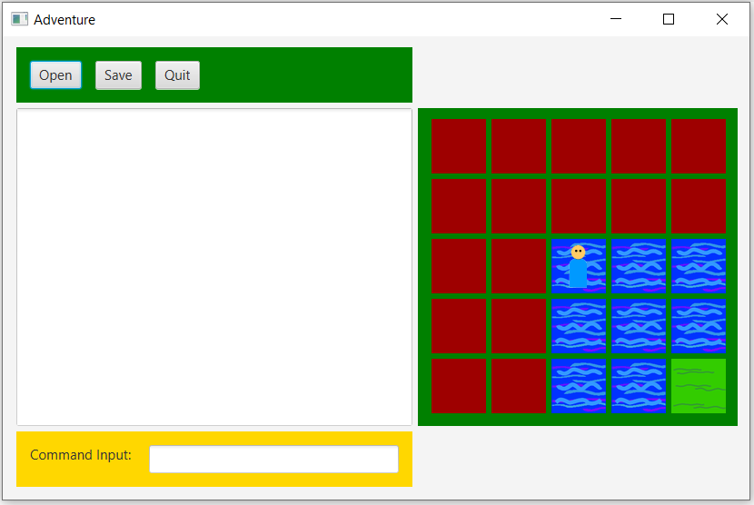
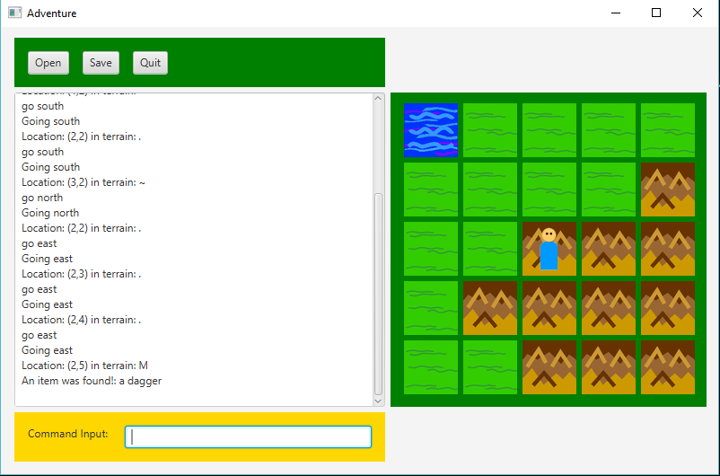
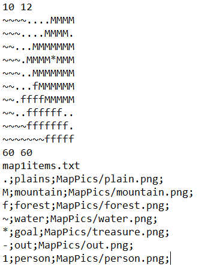

# Treasure_Hunt
This is a small game that I made in a Java class in school.

## Compiling
I used JRE version 1.8 (8) with JDK 8 

To compile: 
javac *.java 

## Running
The main file is called Adventure and you need to specify a map .txt file to create the map.
Make sure to have MapPics folder, map1items.txt (this file should not be edited) and the map.txt in the same directory as the java files

To run: 
java Adventure map1.txt 

There isn't an objective in the game. It is to wonder around and search for supplies.

## Customizing a map file
A map file can be customized with an n x m matrix of characters. 

The layout is as follows:
rows x columns
layout of matrix
map height, map width
map1items.txt *required
character to image info

For the characters, use the ones already provided at the bottom. This is the example map1.txt: 

When saving a game, the file type must have .dat extension 

commands: 
go east (moves left) 
go west (moves right) 
go north (moves up) 
go south (moves down) 
take itemName // takes an item 
drop itemName // drops an item
